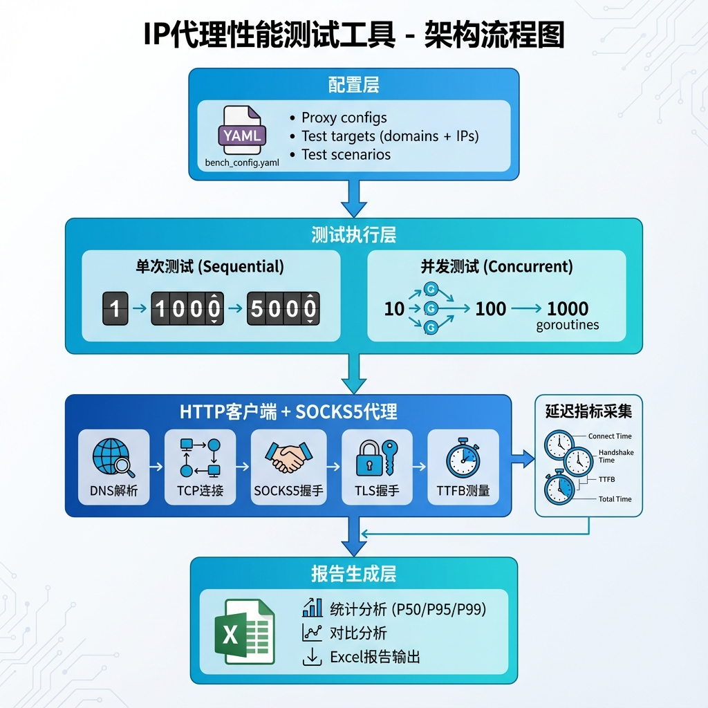

# IP代理性能测试工具

专业的IP代理性能测试和对比分析工具，用于评估不同代理服务的延迟、成功率和性能差异。

## 功能特性

- ✅ **多维度延迟测量**：DNS解析、TCP连接、SOCKS5握手、TLS握手、TTFB、总延迟
- ✅ **统计分析**：平均值、P50/P95/P99百分位数、最小/最大值
- ✅ **测试模式**：单次请求测试、并发测试
- ✅ **自动化报告**：生成专业的Excel对比报告
- ✅ **多格式导出**：支持CSV、JSON、HTML三种格式导出，HTML报告包含可视化图表
- ✅ **灵活配置**：YAML配置文件支持多代理、多目标、多场景
- ✅ **实时进度**：测试过程中显示实时进度和统计

## 架构说明



工具采用分层架构设计：

1. **配置层**：通过YAML文件定义代理、测试目标（域名/IP）、测试场景
2. **测试执行层**：支持单次测试和并发测试两种模式
3. **HTTP客户端层**：集成SOCKS5代理，测量各阶段延迟（DNS、TCP、SOCKS5、TLS、TTFB）
4. **指标采集层**：实时收集和计算延迟指标
5. **报告生成层**：生成包含统计分析（P50/P95/P99）的Excel报告

## 快速开始

### 1. 前置要求

- Go 1.21+ （如果需要从源码构建）
- 或直接使用已编译的可执行文件

### 2. 配置测试

编辑 `configs/bench_config.yaml`：

```yaml
# 配置代理服务器
proxies:
  titan:
    socks5: "127.0.0.1:1080"
    name: "泰坦代理"
    username: ""
    password: ""

# 配置测试目标
targets:
  - name: "YouTube视频页面"
    url: "https://www.youtube.com/watch?v=dQw4w9WgXcQ"
    method: "GET"
    timeout: 30s

# 配置测试场景
scenarios:
  - name: "单次请求测试_1000次"
    type: "single"
    count: 1000
    enabled: true
  
  - name: "100并发测试"
    type: "concurrent"
    concurrency: 100
    count: 100
    enabled: true
```

### 3. 运行测试

```bash
# 确保代理服务正在运行
# 例如，启动泰坦代理客户端：
cd ../client
go run main.go --uuid <your-uuid> --direct-url http://localhost:41005/node/pop

# 在另一个终端运行测试
cd ../benchmark

# Mac用户运行
./bin/benchmark-mac

# Linux用户运行
./bin/benchmark-linux

# 或使用make命令
make run
```

> **提示**：
>
> - Mac用户使用 `benchmark-mac`
> - Linux用户使用 `benchmark-linux`
> - 两个可执行文件都已预编译好，无需安装Go环境

### 4. 🚀 批量测试多个代理（新功能）

**快速批量测试所有SOCKS5节点到YouTube的访问情况：**

```bash
# 1. 在配置文件中添加多个代理节点
vim configs/bench_config.yaml

# 添加节点配置：
# proxies:
#   node-1:
#     socks5: "proxy1.example.com:1080"
#     name: "节点1-美国"
#   node-2:
#     socks5: "proxy2.example.com:1080"
#     name: "节点2-日本"
#   ...

# 2. 批量测试所有节点
./bin/benchmark-mac --test-all-proxies

# 3. 快速批量测试（只测100次，适合筛选优质节点）
./bin/benchmark-mac --test-all-proxies --count 100 --mode single

# 4. 批量测试到YouTube的延迟
./bin/benchmark-mac --test-all-proxies --target https://www.youtube.com --count 50
```

**批量测试优势**：

- ✅ 一次运行测试所有节点
- ✅ 自动生成包含所有节点对比的Excel报告
- ✅ 快速筛选出优质节点
- ✅ 节省时间，无需逐个测试

### 5. 查看报告

测试完成后，工具会自动生成多种格式的报告：

#### Excel报告（默认）

Excel报告保存在 `reports/benchmark_report.xlsx`，包含：

- **测试概览**：所有测试的汇总信息
- **详细测试数据**：每个测试的完整统计指标
- **对比分析**：不同代理的性能对比（如果测试多个代理）

#### 多格式导出（CSV、JSON、HTML）

工具现在支持将测试结果导出为CSV、JSON和HTML格式，特别是**HTML格式提供美观的可视化图表**！

```bash
# 导出所有格式（CSV + JSON + HTML）
./bin/benchmark-mac --test-all-proxies --export-formats csv,json,html

# 只导出HTML格式
./bin/benchmark-mac --test-all-proxies --export-formats html

# 只导出CSV和JSON
./bin/benchmark-mac --export-formats csv,json

# 指定导出目录
./bin/benchmark-mac --export-formats html --export-dir my_reports
```

**导出格式对比**：

| 格式 | 特点 | 适用场景 |
|------|------|----------|
| **HTML** | 📊 包含交互式图表、美观的表格、自动高亮最佳/最差节点 | 向团队展示、快速查看对比 |
| **CSV** | 📈 纯文本、易于导入Excel/Python进行二次分析 | 数据分析、自动化处理 |
| **JSON** | 🔧 结构化数据、编程友好 | API集成、自动化工具 |
| **Excel** | 📑 传统格式、包含多个工作表 | 详细报告、归档 |

**HTML报告特性**：

- ✨ 现代化设计，渐变色背景
- 📊 使用Chart.js绘制延迟对比图表
- 🎯 自动标记最佳节点（绿色徽章）和最慢节点（红色徽章）
- 📱 响应式设计，支持移动设备查看
- ⚡ 成功率色彩编码（绿色：≥95%，黄色：≥80%，红色：<80%）

**示例输出**：

```
reports/
├── benchmark_report.xlsx              # Excel报告
├── batch_report_20251230_185620.csv   # CSV导出
├── batch_report_20251230_185620.json  # JSON导出
└── batch_report_20251230_185620.html  # HTML可视化报告 🌟

## 高级用法

### 命令行参数

```bash
# 指定配置文件
./bin/benchmark-mac --config configs/bench_config.yaml

# 指定输出路径
./bin/benchmark-mac --output reports/my_report.xlsx

# 只运行单次请求测试
./bin/benchmark-mac --mode single

# 只运行并发测试
./bin/benchmark-mac --mode concurrent

# 覆盖配置文件中的请求数量
./bin/benchmark-mac --count 500

# 覆盖并发数
./bin/benchmark-mac --concurrency 50

# 测试指定代理
./bin/benchmark-mac --proxy titan

# 测试指定目标
./bin/benchmark-mac --target https://www.google.com

# 🆕 测试IP直连（SOCKS5代理常用场景）
./bin/benchmark-mac --target http://8.8.8.8 --count 100

# 🆕 测试YouTube IP
./bin/benchmark-mac --target http://142.250.185.46 --count 100

# 🆕 高并发压测（1000次）
./bin/benchmark-mac --count 1000 --concurrency 100 --mode concurrent

# 🆕 极限压测（5000次）
./bin/benchmark-mac --count 5000 --concurrency 200 --mode concurrent

# 🆕 导出为HTML格式（可视化报告）
./bin/benchmark-mac --test-all-proxies --export-formats html

# 🆕 导出多种格式
./bin/benchmark-mac --test-all-proxies --export-formats csv,json,html

# 🆕 指定导出目录
./bin/benchmark-mac --export-formats html --export-dir custom_reports
```

### 测试多个代理进行对比

1. 在配置文件中添加第二个代理：

```yaml
proxies:
  titan:
    socks5: "127.0.0.1:1080"
    name: "泰坦代理"
  
  competitor:
    socks5: "competitor-proxy.com:1080"
    name: "竞争对手"
    username: "user"
    password: "pass"
```

1. 分别运行测试：

```bash
# 测试泰坦代理
./bin/benchmark-mac --proxy titan --output reports/titan_report.xlsx

# 测试竞争对手代理
./bin/benchmark-mac --proxy competitor --output reports/competitor_report.xlsx
```

1. 手工合并两份报告数据进行对比，或修改代码支持自动对比

### 小规模演示测试

```bash
# 运行10次请求的快速测试
make demo

# 或
./bin/benchmark-mac --count 10 --mode single
```

### IP直连测试（SOCKS5代理场景）

很多SOCKS5代理的用途是直接通过IP访问目标，绕过DNS解析。配置文件已包含常用IP测试目标：

```bash
# 测试Google DNS (8.8.8.8)
./bin/benchmark-mac --target http://8.8.8.8 --count 100

# 测试Cloudflare DNS (1.1.1.1)
./bin/benchmark-mac --target http://1.1.1.1 --count 100

# 测试YouTube IP直连
./bin/benchmark-mac --target http://142.250.185.46 --count 100

# 批量测试所有代理到8.8.8.8的访问
./bin/benchmark-mac --test-all-proxies --target http://8.8.8.8 --count 50
```

### 高并发压力测试

支持灵活配置并发次数，适用于压力测试场景：

```bash
# 1000次并发测试（100并发数）
./bin/benchmark-mac --count 1000 --concurrency 100 --mode concurrent

# 5000次极限压测（200并发数）
./bin/benchmark-mac --count 5000 --concurrency 200 --mode concurrent

# 10000次压测（500并发数）
./bin/benchmark-mac --count 10000 --concurrency 500 --mode concurrent

# 自定义配置：3000次，300并发
./bin/benchmark-mac --count 3000 --concurrency 300 --mode concurrent
```

## 从源码构建

```bash
# 安装依赖
make deps

# 构建Mac版本
make build-mac

# 构建Linux版本
make build-linux

# 构建所有平台
make build-all
```

## 项目结构

```
benchmark/
├── cmd/
│   └── benchmark.go          # 主程序入口
├── internal/
│   ├── config/
│   │   └── loader.go         # 配置加载器
│   ├── tester/
│   │   ├── types.go          # 数据结构定义
│   │   ├── http_client.go    # HTTP客户端
│   │   ├── statistics.go     # 统计分析
│   │   └── runner.go         # 测试执行器
│   └── reporter/
│       └── excel.go          # Excel报告生成
├── configs/
│   └── bench_config.yaml     # 配置文件
├── reports/                  # 报告输出目录
├── bin/                      # 可执行文件
├── Makefile                  # 构建脚本
├── go.mod                    # Go模块定义
└── README.md                 # 本文档
```

## 测试指标说明

| 指标 | 说明 |
|------|------|
| **DNS解析** | 域名解析到IP地址的时间 |
| **TCP连接** | 建立TCP连接的时间 |
| **SOCKS5握手** | 代理握手协议的时间（估算值） |
| **TLS握手** | 建立安全连接的时间 |
| **首字节时间(TTFB)** | 从发送请求到收到第一个字节的时间 |
| **总延迟** | 完整请求的端到端时间 |

## 统计指标说明

- **平均值(Mean)**：所有请求的平均延迟
- **中位数(P50)**：50%的请求延迟低于此值
- **P95**：95%的请求延迟低于此值
- **P99**：99%的请求延迟低于此值（最慢1%的阈值）
- **最小值/最大值**：最快和最慢的请求延迟

## 常见问题

### 1. 代理连接失败

**问题**：`failed to create HTTP client` 或所有请求都失败

**解决方案**：

- 确认代理服务正在运行
- 检查配置文件中的代理地址和端口
- 如果使用认证，确认用户名和密码正确

### 2. DNS解析或TCP连接时间为0

**说明**：

- **DNS解析时间为0**：在使用 SOCKS5 代理且目标是域名时，DNS 解析通常由远程代理服务器完成，本地客户端不参与，因此显示为 0。如果是 IP 直连测试，也没有域名解析过程，同样为 0。这是正常现象。
- **之前版本显示为0**：在旧版本中，由于启用了 HTTP 连接复用（Keep-Alive），后续请求复用了已有连接，导致没记录到连接耗时。**当前版本已强制禁用 Keep-Alive，确保每次请求都会记录真实的 TCP 和代理握手时间。**

### 3. SOCKS5握手时间说明

**说明**：SOCKS5 握手时间在底层被包含在 `Connect` 周期内。本工具通过计算 `ConnectDone` 与 `TLSStart`（针对 HTTPS）的间隔来估算握手耗时。对于 HTTP 请求，该项可能会计入总延迟中。

### 4. 测试时间过长

**解决方案**：

- 减少请求数量：`--count 100`
- 只运行单次测试：`--mode single`
- 在配置文件中禁用某些场景

### 5. 生成报告失败

**解决方案**：

- 确保 `reports/` 目录存在并有写入权限
- 检查磁盘空间是否足够
- 确保没有其他程序打开目标Excel文件

## 最佳实践

1. **逐步测试**：先运行小规模测试（10-100次）验证配置，再运行完整测试
2. **多次运行**：网络条件可能波动，建议多次测试取平均值
3. **错峰测试**：避免在网络高峰期测试，结果会更稳定
4. **目标选择**：选择稳定的测试目标（如大型网站首页）
5. **对比测试**：确保在相同时间、相同网络环境下测试不同代理

## 开发相关

### 运行单元测试

```bash
make test
```

### 清理构建文件

```bash
make clean
```

## 许可证

本工具为内部使用项目。

## 支持

如有问题或建议，请联系开发团队。
